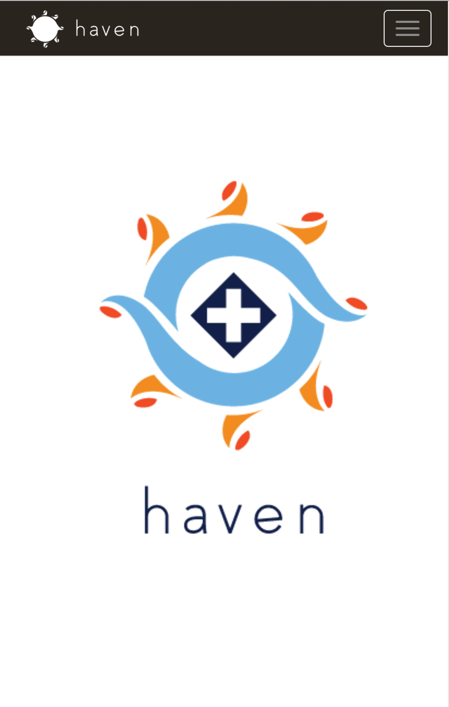

# haven

Haven is set up for a refugee by an organization.  It allows the organization to provide information and assistance to the refugee.  It also allows the refugee to access this information through a simple, language independent interface.  Translation is built in to the application for easy communication between the agency and the refugee.  This application will save the agency time and put control into hands of the refugee. 

## User Story
 Faatimah is from Syria.  Her home was destroyed by ISIS, and an organization helped her get to the United States.  She's now in an apartment with nobody to call, no knowledge of the language and no understanding of how to get anything done within a new culture.  That's where Haven comes in.  It's designed with a language agnostic navigation system and automatic translation built in to every aspect of the application.  Haven helps Faatimah figure out who she can go to for help getting her new life set up, and connects her directly to those people.
 

## Getting Started

### Prerequisites

- [Git](https://git-scm.com/)
- [Node.js and npm](nodejs.org) Node ^4.2.3, npm ^2.14.7
- [Bower](bower.io) (`npm install --global bower`)
- [Ruby](https://www.ruby-lang.org) and then `gem install sass`
- [Grunt](http://gruntjs.com/) (`npm install --global grunt-cli`)
- [MongoDB](https://www.mongodb.org/) - Keep a running daemon with `mongod`

### Developing

1. Run `npm install` to install server dependencies.

2. Run `bower install` to install front-end dependencies.

3. Run `mongod` in a separate shell to keep an instance of the MongoDB Daemon running

4. Run `grunt serve` to start the development server. It should automatically open the client in your browser when ready.

## Build & development

Run `grunt build` for building and `grunt serve` for preview.

## Testing

Running `npm test` will run the unit tests with karma.
